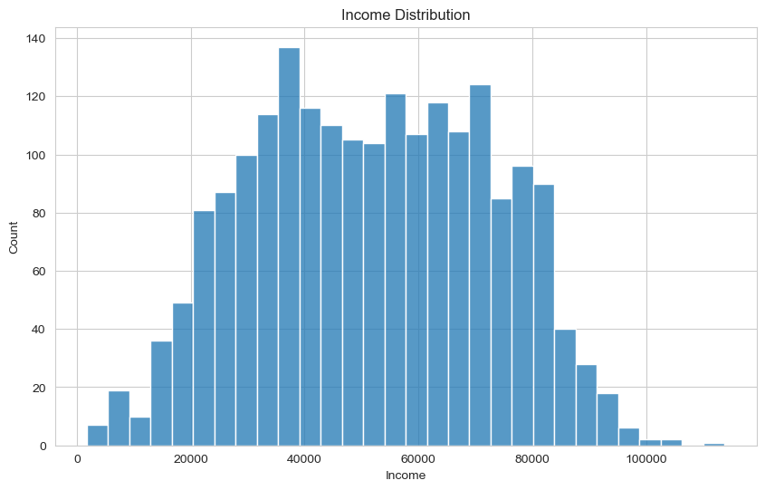
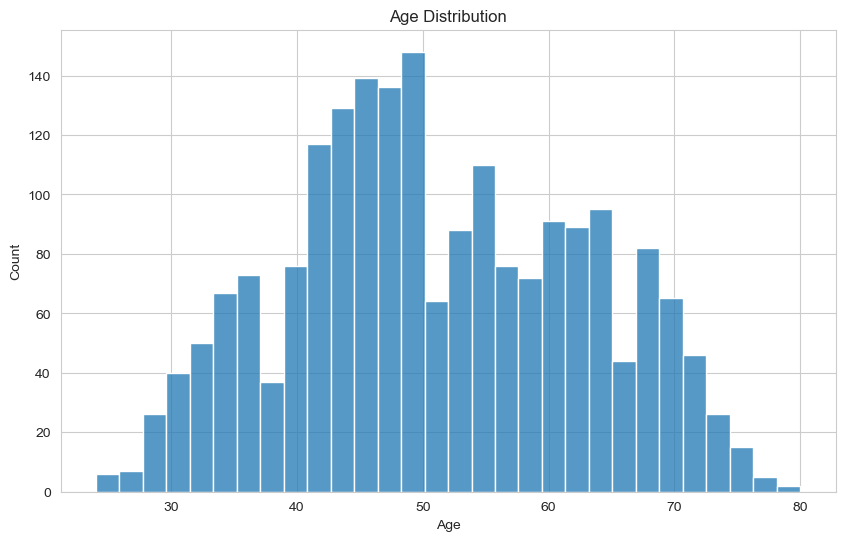
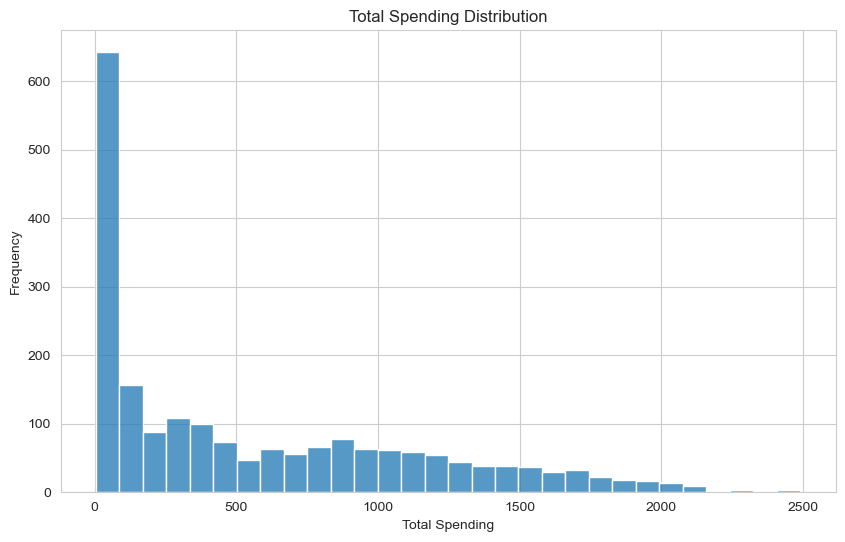
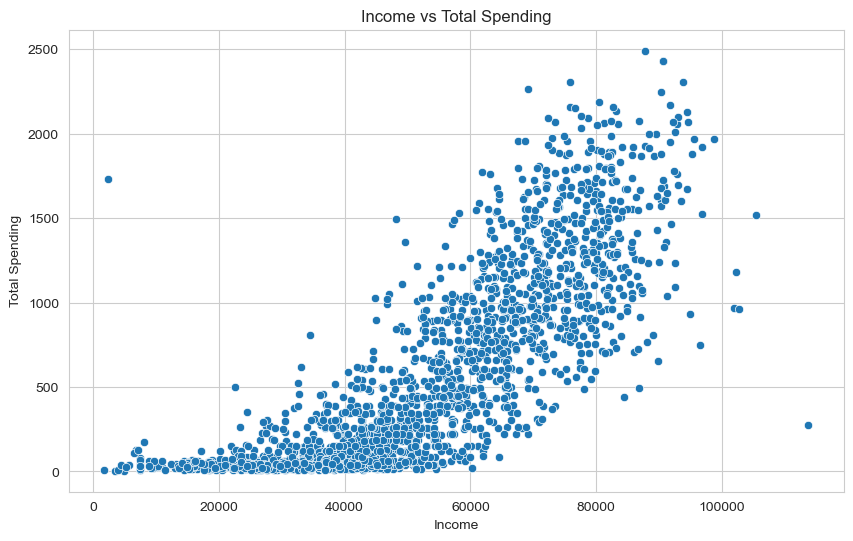
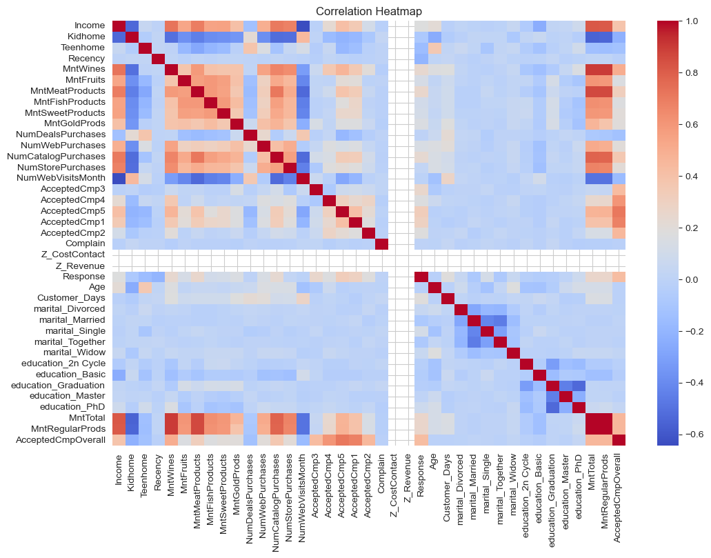
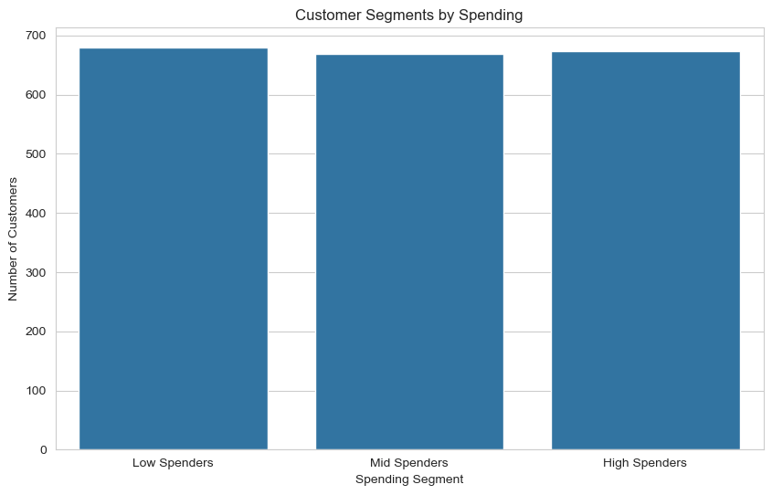
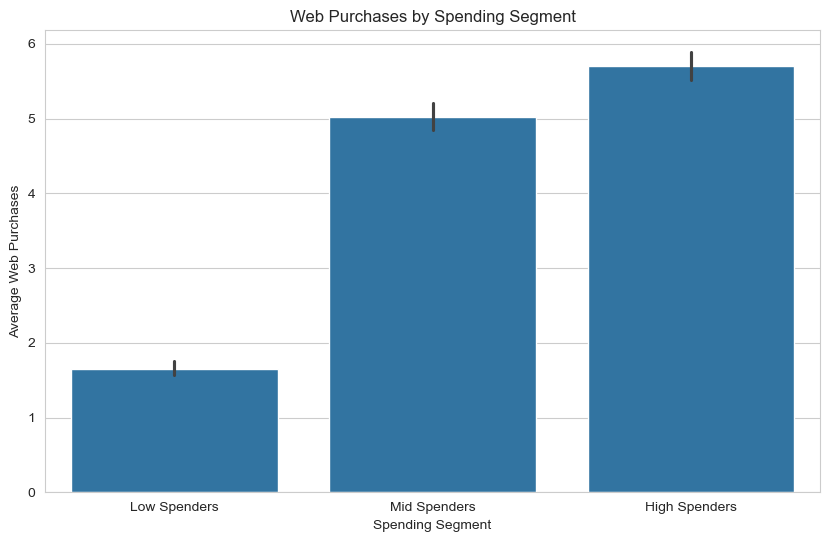
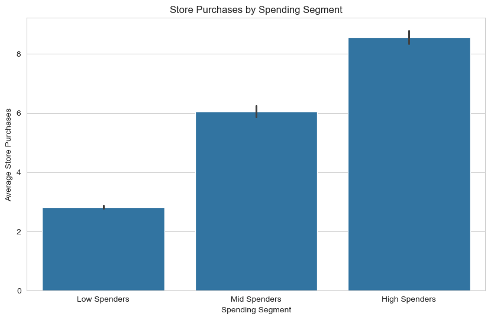
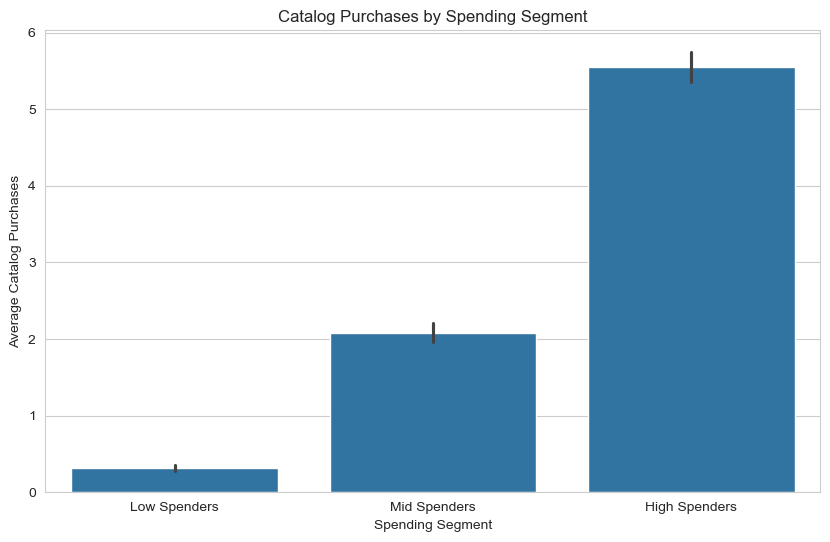
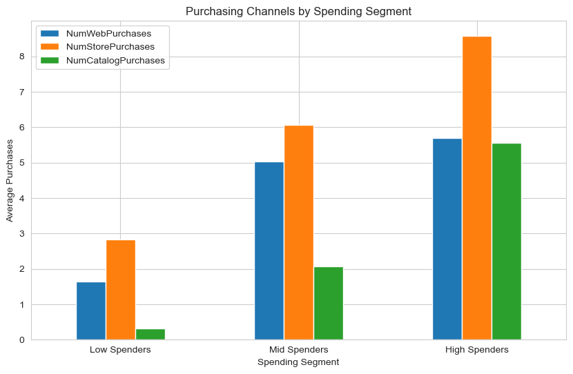

# 🧠 Customer Segmentation & Marketing Analytics

## 📊 Project Overview

This project performs an end-to-end Exploratory Data Analysis (EDA) and customer segmentation on a retail marketing dataset.

The goal is to understand customer behavior, segment customers based on spending patterns, and analyze how different groups interact across purchasing channels.

This analysis translates raw data into actionable business insights for marketing and customer strategy.

---

## 🎯 Objectives

- Understand customer demographics and income distribution
- Analyze purchasing behavior across multiple channels
- Segment customers based on total spending
- Identify high-value customers
- Evaluate campaign response behavior
- Provide data-driven business recommendations

---

## 📁 Dataset Description

The dataset includes customer information such as:

- Income and Age
- Household structure (Kidhome, Teenhome)
- Marital status and education level
- Purchase behavior:
  - Web purchases
  - Store purchases
  - Catalog purchases
- Marketing campaign responses
- Total spending metrics

---

## 🛠️ Tools & Technologies

- Python
- Pandas
- NumPy
- Matplotlib
- Seaborn
- Jupyter Notebook

---

## 🧹 Data Preparation

- Removed duplicate records (~184 rows)
- Verified data types and structure
- Created derived features such as total spending
- Built customer segments using quantile-based grouping

---

## 👥 Customer Segmentation

Customers were divided into three spending-based segments:

- 🟢 Low Spenders
- 🟡 Mid Spenders
- 🔴 High Spenders

---

## 📊 Key Visualizations

### 💰 Income Distribution

### 🎂 Age Distribution

### 💸 Total Spending Distribution

### 📈 Income vs Total Spending

### 🌡️ Correlation Heatmap

### 👥 Customer Segments

---

## 🛒 Customer Behavior by Channel

### 🌐 Web Purchases

### 🏬 Store Purchases

### 📦 Catalog Purchases

### 🔄 Channel Comparison

---

## 📈 Key Insights

- Store purchases are the dominant channel across all segments
- Web purchases grow rapidly from Low to Mid spenders but stabilize in High Spenders
- Catalog purchases are strongly associated with High Value customers
- High Spenders show significantly higher campaign response rates (~25.6%)
- Income is positively correlated with spending behavior but not the only driver

---

## 👤 Customer Profiles

### 🟢 Low Spenders
Low income, low engagement, minimal interaction across channels.

### 🟡 Mid Spenders
Transitional segment with strong growth potential and balanced behavior.

### 🔴 High Spenders
High income, highly engaged, omnichannel customers and main revenue drivers.

---

## 💡 Business Recommendations

### 🎯 Retention Strategy
Focus on retaining High Spenders through loyalty programs and personalized offers.

### 🚀 Growth Strategy
Target Mid Spenders as the main conversion opportunity to increase revenue.

### 📣 Activation Strategy
Increase engagement of Low Spenders through low-cost digital campaigns.

### 🛍️ Channel Strategy
- Store = primary revenue channel
- Web = acquisition & accessibility channel
- Catalog = premium targeting channel

---

## 📌 Final Conclusion

Customer value is driven by both income and engagement behavior across channels.

A successful business strategy should focus on:
- Retaining high-value customers
- Converting mid-tier customers
- Activating low-engagement users

---

## 🚀 Author

Data Analyst portfolio project focused on customer segmentation, marketing analytics, and business insights using Python.